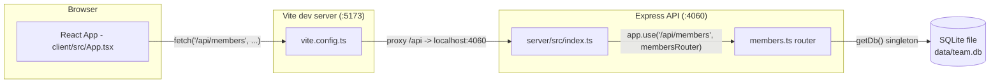

- The client never talks to the server directly by hostname/port — all requests are relative (`/api/members`, see `client/src/App.tsx`), and Vite's dev-server proxy (`client/vite.config.ts`) is what routes them to `localhost:4060`. In a non-dev deployment, whatever serves the built client must reproduce that `/api` proxy/rewrite or the app breaks — nothing in the repo currently does this (there's no reverse-proxy config or static-serving code in `server/src/index.ts`).
- `getDb()` (`server/src/db.ts:11`) is a module-level lazy singleton — one process, one `DatabaseSync` connection, created on first call and reused for the process lifetime. Tests rely on this: they set `TEAMBOARD_DB_PATH=':memory:'` before the first request so the singleton is born pointing at an in-memory DB (see [[testing]]).
