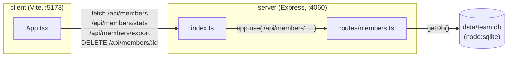

- The client never talks to the server directly by host:port — Vite's dev
  proxy (`client/vite.config.ts:8`) forwards any `/api/*` request to
  `http://localhost:4060`, so both must be running (`pnpm dev` starts both
  via `concurrently`).
- `getDb()` (`server/src/db.ts:11`) is a module-level singleton: the first
  call opens/creates `data/team.db`, creates the table if missing, and seeds
  8 rows if the table is empty. Every route handler calls `getDb()` fresh but
  gets the same connection.
- There's no separate service boundary beyond client/server — `members.ts` is
  the only router, mounted once at `/api/members` in `server/src/index.ts:11`.
