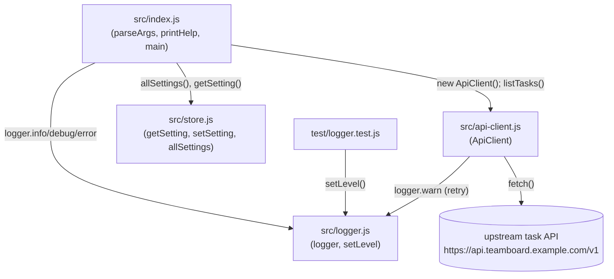

Single-process CLI, no server component. `src/index.js` is the only entrypoint
and the only module that imports the other three.

Notes on edges that aren't obvious from file names:

- `store.js` is never imported by `api-client.js` or `logger.js` — settings
  flow one-way, from `index.js` down. `getSetting('retention.days')` is read
  in `index.js:58` only to log it; it isn't passed into `ApiClient`.
- `api-client.js` depends on `logger.js` for retry-warning output, so logger
  changes (e.g. adding a `--quiet` mode) affect both the CLI's own output and
  the client's retry logging.
- There is no inbound network side (no Express/HTTP server anywhere in the
  repo) — `ApiClient` is purely an outbound caller to a third-party-shaped
  URL that does not exist in this repo.
