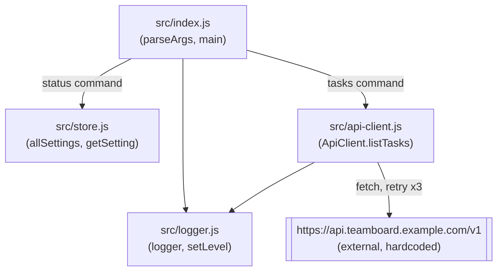

Everything runs in one Node process; there is no client/server split and no
network service of teamboard's own. `ApiClient` talks to one external,
hardcoded upstream (`https://api.teamboard.example.com/v1`) — the only
outbound dependency.

Notes on edges that aren't obvious from the code alone:
- `status` reads settings via `store.js` and never touches `ApiClient`.
- `tasks` reads one setting (`retention.days`) purely to log it — it is not
  passed to `ApiClient.listTasks`, so changing that default does not change
  request behavior today.
- `ApiClient` logs its own retry attempts through the shared `logger`, so
  `--verbose` (which calls `setLevel('debug')`) also surfaces retry noise.
