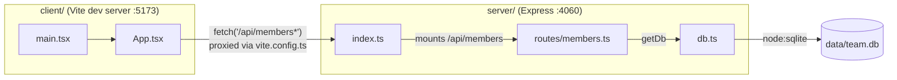

- `App.tsx` never imports `db.ts` or any server module directly — the only link between client and server is the HTTP/JSON boundary at `/api/members*`, proxied in dev by `client/vite.config.ts:9`.
- `index.ts` mounts the entire members router at the `/api/members` prefix (`server/src/index.ts:11`); every route inside `members.ts` is defined relative to that prefix.
- `db.ts` is the only file that touches `node:sqlite`; `members.ts` never opens a connection itself, it always goes through `getDb()`.
