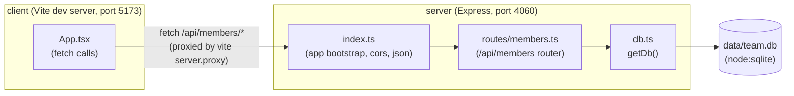

- The client never talks to the server directly by absolute URL: Vite's dev
  proxy (`client/vite.config.ts`) forwards `/api/*` to
  `http://localhost:4060`, so `App.tsx` just calls `fetch('/api/members')`.
- `db.ts` holds a single module-level `db` singleton (lazy-initialized on
  first `getDb()` call) — there's no connection pool or per-request client.
- Tests bypass the Express app bootstrap in `index.ts` entirely: they mount
  `membersRouter` directly on a throwaway `express()` instance
  (`server/src/routes/members.test.ts`), so `cors()` / global middleware in
  `index.ts` are not exercised by the test suite.
