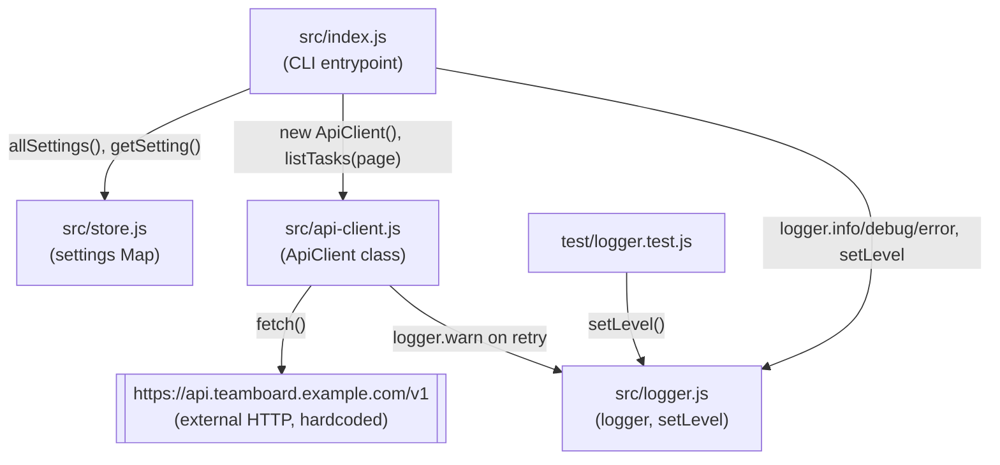

Single-process CLI, no network services, no database, no build step — the whole
"architecture" is four ESM modules imported directly by the entrypoint.

Notes on the non-obvious edges:
- `ApiClient` imports `logger` only to log retry warnings — it never touches `store.js`, so `baseUrl`/`region` are constructor-time values, not settings-driven.
- `store.js` is read by `index.js` directly (`allSettings()`, `getSetting('retention.days')`); nothing else in `src/` touches it.
- The only test (`test/logger.test.js`) exercises `logger.js` in isolation; `api-client.js`, `store.js`, and `index.js` have no test coverage.
