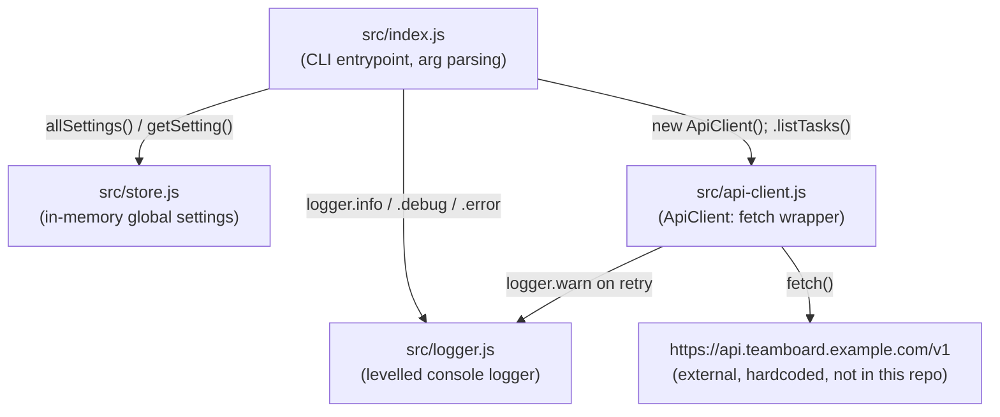

Everything is one process. There is no HTTP server, no database, no
client/server split — `src/index.js` is the whole CLI, and `ApiClient`
makes outbound requests to an external (unimplemented, hardcoded) task API.

Notes:
- `ApiClient` is the only module that talks to the network; it retries 3
  times with exponential backoff (`250 * 2 ** attempt` ms) and a 15s
  per-attempt timeout — all hardcoded, see [fixture-notes](fixture-notes.md).
- `store.js` is a module-level `Map`, so state is process-lifetime only and
  shared globally — there is no per-tenant or per-request scoping.
- No `config.ts`/`config.js` module exists despite README.md pointing to one
  — see the divergence note in [fixture-notes](fixture-notes.md).
