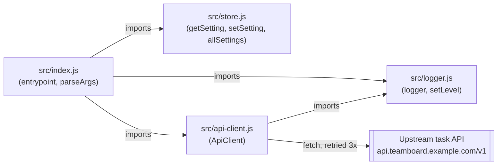

Single-process Node CLI, no services, no queue, no database. The only
cross-boundary call is `ApiClient.request` doing `fetch` against a
third-party (fixture) upstream URL.

Notes:
- `Store` and `Client` do not import each other; `index.js` wires
  `getSetting('retention.days')` into a debug log line before calling
  `client.listTasks`, but that value isn't passed into the request — it's
  informational only (`src/index.js:58-59`).
- `test/logger.test.js` imports only `src/logger.js` directly; there is no
  test coverage for `index.js`, `api-client.js`, or `store.js` yet.
