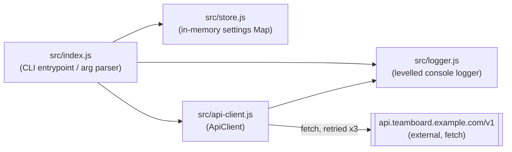

Single-process Node CLI, no framework, no build step. Four modules total.

`src/index.js` is the only module that touches `process.argv`; it wires the
other three together per-command (`status` reads `src/store.js`, `tasks`
drives `src/api-client.js`). `src/store.js` has no persistence and no
tenant/namespace dimension — every process boots with the same three
defaults (`notifications.enabled`, `board.columns`, `retention.days`).
`src/api-client.js` is the only module that leaves the process (via
`fetch`); it retries up to 3 times with exponential backoff before throwing.
