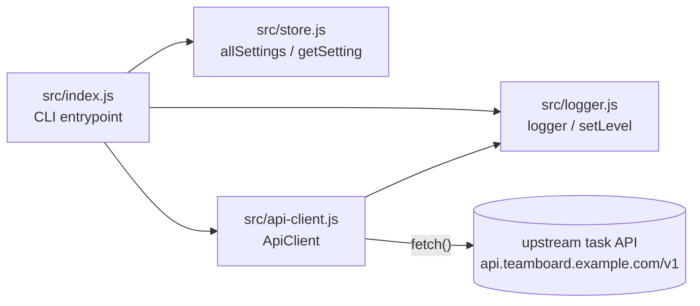

Single-process CLI, no server, no database. Everything runs synchronously in
one `node` invocation.

- `index.js` is the only file that imports the other three; `logger.js` and
  `store.js` never import each other.
- `ApiClient.request()` retries up to 3 times against the upstream URL with
  exponential backoff, logging each retry via `logger.warn`. The upstream host
  is a hardcoded placeholder (`api.teamboard.example.com`) — there is no real
  server behind it, and none is expected in this repo.
- No routing, no persistence layer, no client/server split. Treat any mention
  of `client/`, `server/`, SQLite, or Express as belonging to a different
  project — this repo has none of that.
