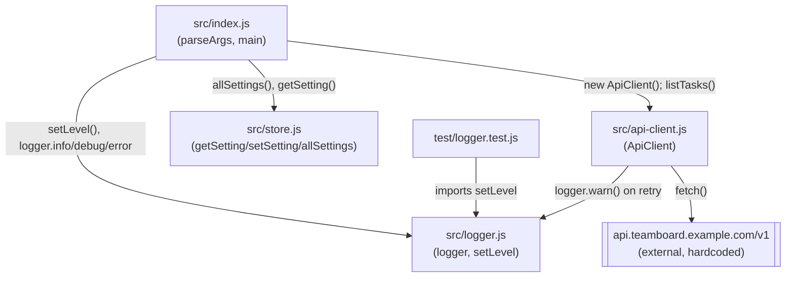

Single-process CLI, no server, no database, no network boundary other than
the outbound fetch in `ApiClient`.

Notes:
- `ApiClient` is the only module with an external dependency (`fetch` to a
  hardcoded base URL); everything else is in-process.
- `src/store.js` has no persistence — state resets on every process start.
- There is no `src/config.ts` and no env-var reads anywhere in `src/` (see the
  divergence note in [[overview]]).
