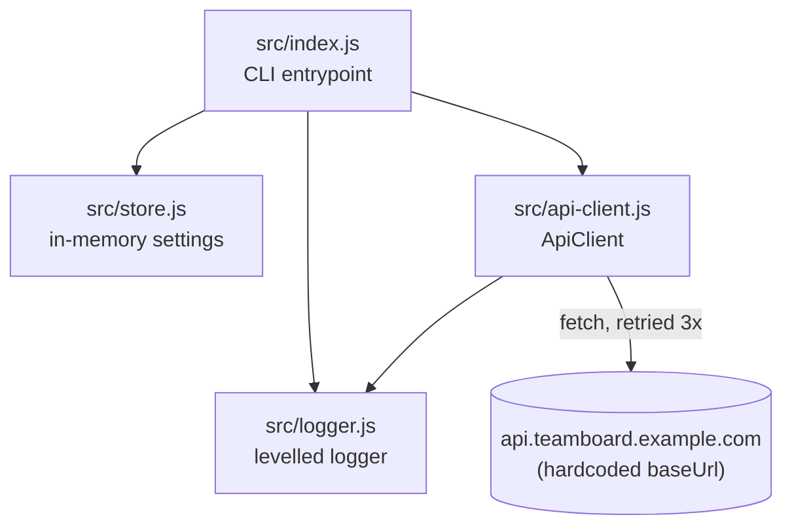

Single-process Node CLI, four modules, no services, no database. All edges
below are plain ESM `import`s verified in the source.

Notes on the non-obvious edges:

- `ApiClient` logs its own retries through `src/logger.js` (`logger.warn`
  on each failed attempt) — the CLI never sees intermediate retry state,
  only the final result or thrown error.
- `src/store.js` has no consumers besides `src/index.js`; it is not read by
  `ApiClient`, so settings like `retention.days` are looked up in `index.js`
  and passed into `logger.debug` calls, not into the client itself.
- There is no persistence layer — `Store`'s `settings` Map resets on every
  process start; only `DEFAULTS` survives across runs.
