```mermaid
flowchart LR
    Browser -->|renders| App["client/src/App.tsx\n(React component)"]
    App -->|"fetch /api/members\n/api/members/stats\n/api/members/:id"| ViteProxy["Vite dev server :5173\nproxy /api → :4060"]
    ViteProxy --> Express["server/src/index.ts\nExpress app :4060"]
    Express -->|"mounted at /api/members"| Router["server/src/routes/members.ts"]
    Router -->|"getDb()"| SQLite["server/src/db.ts\nnode:sqlite DatabaseSync"]
    SQLite --> File["data/team.db\n(gitignored, auto-created)"]
```

- The client never talks to the server directly by URL — it always calls same-origin `/api/...` paths, and Vite's dev proxy (`client/vite.config.ts`) forwards those to `http://localhost:4060`. There's no CORS-relevant client config; `cors()` in `server/src/index.ts:8` is permissive (no origin restriction), which only matters if something calls the API from a non-proxied origin.
- `getDb()` is called per-request inside each route handler (`server/src/routes/members.ts`), not once at startup — the first call creates the file/table/seed data lazily.
- There is one Express router (`membersRouter`) mounted at one path; all member CRUD, `/export`, and `/stats` live in the same file (`server/src/routes/members.ts`), not split into separate route modules.
