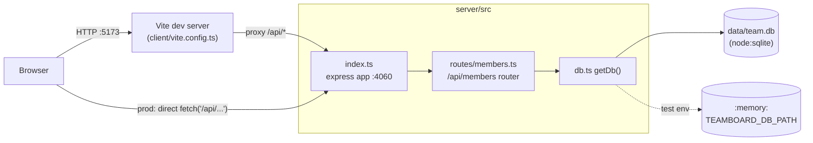

Notes on the non-obvious edges:
- `getDb()` (`server/src/db.ts:11`) memoizes the `DatabaseSync` handle in a
  module-level `let db` — the first call wins. Tests rely on this: they must
  set `process.env.TEAMBOARD_DB_PATH = ':memory:'` before any handler runs
  `getDb()` for the first time, or they'll open the real `data/team.db` file
  instead (see `server/src/routes/members.test.ts:24`).
- There is no shared client/server package or type import — `Member` in
  `client/src/App.tsx:3` and `MemberRow` in `server/src/routes/members.ts:4`
  are hand-duplicated interfaces. Changing the DB schema means updating both
  by hand; nothing enforces they stay in sync.
- `index.ts` only mounts `/api/members`; it does not serve the built client,
  so `pnpm start` alone will not serve the UI — `pnpm dev` runs both via
  `concurrently` (see `package.json` scripts).
