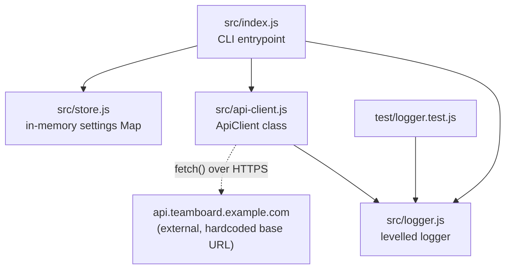

Despite the project name, this is not a client/server web app — it's a single
flat CLI package under `src/`, with no database and no network server of its
own.

- `src/index.js` is the only file with fan-out; it directly imports and calls
  all three peer modules.
- `src/api-client.js` is the sole module that reaches outside the process
  (via the global `fetch`), and it logs through `src/logger.js` on retry.
- `src/store.js` holds settings only in a module-level `Map` — nothing is
  persisted to disk or a database, so there is no data-model page for this
  repo.
- `test/logger.test.js` is the only test file and exercises `src/logger.js`
  exclusively.
