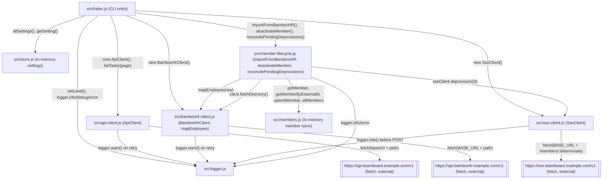

Single-process Node CLI, no network server, no database. `src/index.js` is
the entrypoint and imports six other modules. Most of those don't import
each other — the one exception is `member-lifecycle.js`, which imports
`members.js` (the member store) and `mapEmployee` from `bamboohr-client.js`.

Notes on edges that aren't obvious from the diagram:

- `ApiClient`, `BambooHrClient`, and `SsoClient` are all instantiated fresh in
  `index.js` per command invocation; none is a singleton and none holds
  state beyond its constructor args (`baseUrl`/`region`, `apiKey`, `token`).
- `store.js`'s settings map and `members.js`'s member map (`members` +
  `byExternalId`) are both module-level (`new Map()`), so each is a
  process-global singleton for the CLI's lifetime — same pattern, two
  independent stores that never reference each other.
- `member-lifecycle.js` never constructs `BambooHrClient`/`SsoClient`
  itself — `client` and `ssoClient` are always passed in by the caller
  (`index.js` in production, a fake object in tests). This is the only
  place in the app that uses constructor/param dependency injection instead
  of a module importing a concrete class directly.
- `logger.js` picks stdout vs stderr per call (`warn`/`error` → stderr,
  `debug`/`info` → stdout) based on level, not on any config.
- `deactivateMember` calls `ssoClient.deprovision` synchronously as part of
  deactivation; on failure it records `deprovisionPendingSince` on the
  member instead of throwing, and `reconcilePendingDeprovisions` is the only
  code path that retries those — it is not triggered automatically, only by
  the `members:reconcile-sso` CLI command.
