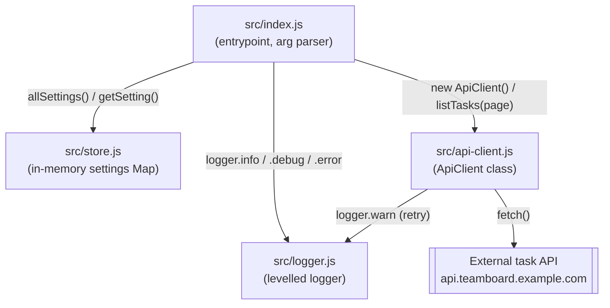

Single-process Node CLI, no server and no persistence layer. `src/index.js`
is the only entrypoint (`package.json` `main`/`start`) and is the sole
importer of the other three modules.

## Non-obvious edges

- `ApiClient` depends on `logger` (to log retry warnings) but not on `store`
  — the retention setting `retention.days` is read in `src/index.js` and
  merely logged for the `tasks` command; it is never passed into
  `ApiClient.listTasks`, which always requests `page=1&per_page=50`
  regardless of that setting.
- `store.js` has no consumers other than `src/index.js` (`allSettings()` for
  `status`, `getSetting('retention.days')` for `tasks`). Nothing writes to it
  at runtime today — `setSetting` is exported but currently unused.
