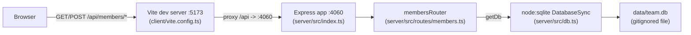

- The client never talks to the server directly in dev — `vite.config.ts` proxies any `/api` path to `http://localhost:4060`; there's no `VITE_API_URL`-style env indirection.
- `getDb()` in `server/src/db.ts` lazily opens a single module-scoped `DatabaseSync` handle and creates the `members` table + seed rows on first call if the DB is empty — there's no separate migration step or seed script.
- Test code (`server/src/routes/members.test.ts`) redirects the same `getDb()` to an in-memory DB via `TEAMBOARD_DB_PATH=':memory:'`, set as a `process.env` write before the router is imported — it does not spin up a second server process.
