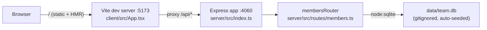

- The client never talks to the server directly in dev — Vite's `server.proxy` (`client/vite.config.ts:8-10`) forwards `/api/*` to `http://localhost:4060`, so both processes must be running (`pnpm dev` starts both via `concurrently`).
- `getDb()` (`server/src/db.ts:11`) is a lazy module-level singleton: the first caller opens/creates `data/team.db` and seeds it if empty. There is no separate migration step or seed script.
- The whole API surface is one router (`membersRouter`) mounted at `/api/members` — no other routers or services exist.
