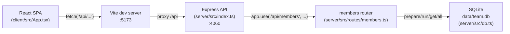

Single process pairs: one Express app (`server/src/index.ts`) mounting one router (`members.ts`) against one lazily-initialized `DatabaseSync` singleton (`getDb()` in `db.ts`). There is no service boundary beyond client vs. server — everything server-side shares the one module-level `db` variable, so tests must swap `TEAMBOARD_DB_PATH` to `:memory:` **before** the first `getDb()` call (see `../conventions/testing.md`).
