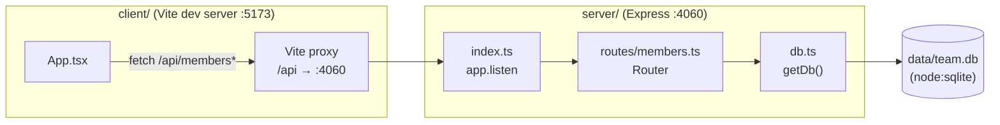

- The client never talks to the server directly in dev — `client/vite.config.ts:8` proxies `/api` to `http://localhost:4060`, so `App.tsx` always calls relative paths like `/api/members`. There is no `VITE_API_URL` or similar env indirection.
- `server/src/index.ts:11` mounts the entire members router at `/api/members`; every route in `members.ts` is relative to that prefix (e.g. the handler at `members.ts:48` is `GET /api/members/export`, not `/api/export`).
- `db.ts:11` (`getDb`) is a lazy singleton: the first caller (whichever route handler runs first) triggers table creation and seeding. There is no separate migration/seed script — schema and seed data live inline in `getDb`.
- Route ordering in `members.ts` matters: `/export` (`members.ts:48`) and `/stats` (`members.ts:60`) are registered before the `/:id` (`members.ts:71`) catch-all, which is required for Express to route `GET /api/members/export` correctly instead of matching `:id="export"`. Keep this order if adding new fixed sub-paths.
