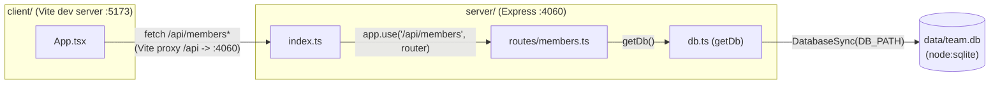

Client and server are two independent processes started together only via
`concurrently` in `pnpm dev` (`package.json:10`) — there is no shared build, no
SSR, and no direct import between `client/` and `server/`. The only coupling is
the Vite dev-server proxy (`client/vite.config.ts:8-10`) forwarding `/api/*` to
`http://localhost:4060`, and the JSON shapes both sides independently declare
(`Member`/`Stats` in `App.tsx:3-16` vs `MemberRow` in `members.ts:4-14` — these
are not a shared type import, so if one side's columns change the other must be
updated by hand).

`getDb()` (`db.ts:11`) is a lazy singleton: the first caller in the process
creates the file (or `:memory:`), runs `CREATE TABLE IF NOT EXISTS`, and seeds 8
rows if the table was empty. Every route handler calls `getDb()` per-request but
only pays the setup cost once per process.
