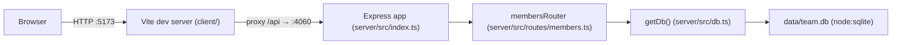

- The client never talks to the server directly in dev — Vite's `server.proxy` config (`client/vite.config.ts`) forwards any `/api/*` request to `http://localhost:4060`. There's no proxy config for a built/production client; see [[overview]] for the missing build step.
- `server/src/index.ts` mounts the entire members feature as one router at `/api/members`; there is only one route module in this repo.
- `getDb()` is a lazy singleton (module-level `db` variable) — the SQLite file/connection is created on first call, not at server startup. Tests override this via `TEAMBOARD_DB_PATH=':memory:'`, set as an env var before the first request (see [[testing]]).
