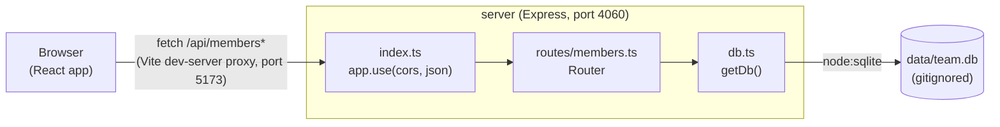

- `client/src/App.tsx` calls `fetch('/api/members')`, `/api/members/stats`, and posts/deletes to `/api/members` and `/api/members/:id`. There is no separate API client module — all fetch calls live directly in `App.tsx`'s handlers (`loadMembers`, `loadStats`, `addMember`, `removeMember`).
- `client/vite.config.ts` proxies `/api` to the server during `pnpm dev:client`; in production the client would need to be served behind the same origin as the Express app (no such serving path exists yet — `index.ts` only mounts the API router, it does not serve `client/dist`).
- `getDb()` (`server/src/db.ts:11`) is a lazy singleton: the first call opens/creates the SQLite file (or `:memory:` for tests) and seeds it if empty. Every route handler calls `getDb()` per-request rather than importing a shared instance.
