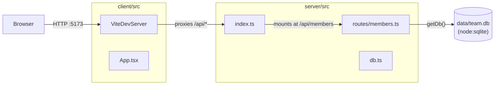

- The client never talks to SQLite directly — all access goes through
  `getDb()` in `server/src/db.ts:11`, called lazily per-request from
  `server/src/routes/members.ts`. `getDb()` memoizes a single module-level
  `db` connection for the process lifetime (`server/src/db.ts:9`).
- In dev, Vite (port 5173) proxies `/api` to the Express server (port 4060)
  per `client/vite.config.ts:8-10`; there is no shared build step wiring
  these together beyond that proxy rule.
- `server/src/routes/members.test.ts` bypasses both the proxy and the port
  4060 default: it builds an in-process Express app directly around
  `membersRouter` and points `TEAMBOARD_DB_PATH` at `:memory:`, so tests never
  touch `data/team.db`.
