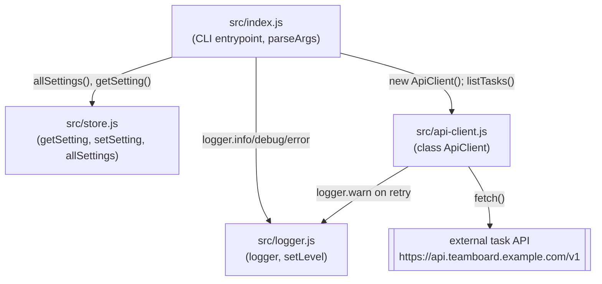

Everything runs in one process. `src/index.js` is the only file that imports
from all three modules; `logger.js` and `store.js` never import each other or
`api-client.js`. `api-client.js` imports only `logger.js` (to log retries) —
it has no dependency on `store.js`, even though `index.js` reads
`retention.days` from the store and passes nothing from it into the client
call (`listTasks(1)` ignores that setting today).

No database, no HTTP server, no `client/`+`server/` split — despite the repo
name and any external index that suggests otherwise, this is a single CLI
package. There is no `knowledge/data-model.md` page because there is no
schema, migration, or ORM model anywhere in the repo.
