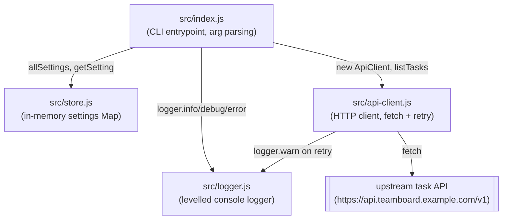

Four modules, no external network in tests, no database. `src/index.js` is
the only entrypoint; the other three are leaf-ish modules it wires together.

Notes on edges that aren't obvious from the diagram alone:

- `api-client.js` depends on `logger.js` (it logs a warning on every retry),
  but `store.js` and `api-client.js` never import each other — the `tasks`
  command in `index.js` reads `retention.days` from the store purely to log
  it, it doesn't pass it into the `ApiClient` request.
- There's no route from `store.js` to `api-client.js` or vice versa — the
  settings store and the HTTP client are independent; only `index.js` touches
  both.
- No test file exercises `api-client.js` or `store.js` — see
  [[conventions-testing]].
