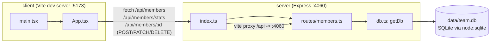

- The client never talks to SQLite directly; all reads/writes go through the `/api/members*` routes in `server/src/routes/members.ts`.
- `getDb()` is the single entry point for DB access and lazily creates+seeds the SQLite file on first call (`server/src/db.ts:11-48`) — there is no separate migration step or seed script.
- The Vite proxy (`client/vite.config.ts:8-10`) is dev-only; in production the client build would need to be served behind the same origin as the API or the proxy target reconfigured.
