```mermaid
flowchart LR
    Browser["Browser (App.tsx)"] -->|"fetch('/api/members...')"| ViteProxy["Vite dev server\n(client/vite.config.ts)"]
    ViteProxy -->|"proxy /api -> :4060"| Express["Express app\n(server/src/index.ts)"]
    Express --> MembersRouter["membersRouter\n(server/src/routes/members.ts)"]
    MembersRouter -->|"prepared statements"| SQLite["node:sqlite DatabaseSync\n(server/src/db.ts)"]
    SQLite --> DBFile["data/team.db\n(or ':memory:' in tests)"]
```

- The client never talks to the server directly by host/port; it calls
  relative `/api/...` paths and relies on the Vite dev proxy
  (`client/vite.config.ts`) to forward to `http://localhost:4060`. There is
  no proxy/reverse-proxy config for a production deployment in this repo —
  `pnpm start` only serves the compiled server, so serving the built client
  in production is not wired up here.
- `getDb()` in `server/src/db.ts` is a lazy singleton: the first caller
  creates the `DatabaseSync` connection and seeds it if empty; every route
  handler in `members.ts` calls `getDb()` per-request but reuses the same
  connection.
