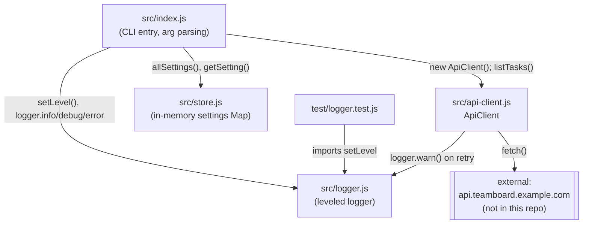

Single-process Node.js CLI, no network server of its own. `src/api-client.js` is the only piece that talks to anything external, and that external thing (`api.teamboard.example.com`) is outside this repo — there is nothing here to run locally to serve it.

Notes:
- `package.json` has `"main": "src/index.js"` and `"type": "module"` — all imports are native ESM with explicit `.js` extensions (e.g. `import { logger } from './logger.js'`), not CommonJS `require`.
- There's no dependency-injection or config layer between these modules; `index.js` imports the other three directly and wires them by hand in `main()`.
