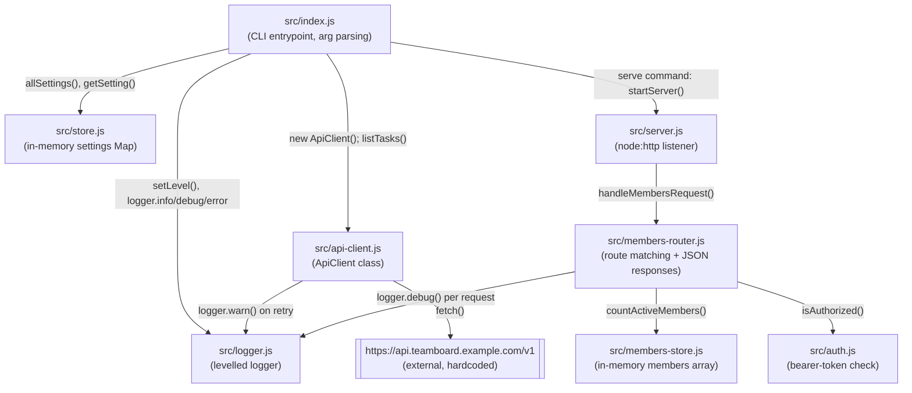

CLI + HTTP server split, eight modules, still no database — everything is in-memory.

Notes on edges that aren't obvious from file names:

- `src/index.js`'s `tasks` command is the only path that touches `ApiClient`; the `serve` command is the only path that touches `src/server.js`. `status` and `help` touch neither.
- `ApiClient.request()` calls back into `logger.warn` on every retry attempt, so `logger.js` now has three callers (`index.js`, `api-client.js`, `members-router.js`), not one.
- `src/server.js` has no route-matching logic of its own — it builds a `URL` from the request and delegates entirely to `members-router.js#handleMembersRequest`, falling back to a bare 404 if that returns false.
- `src/members-store.js` is a second, independent in-memory store from `src/store.js` — don't conflate them. `store.js` holds CLI settings (a `Map`); `members-store.js` holds the members array backing the HTTP API.
- `process.env.TEAMBOARD_API_TOKEN` is read in two places that don't share code: `src/auth.js#isAuthorized` (the actual check, via `timingSafeEqual`) and `src/index.js`'s `serve` command (a startup warning only, if unset). There is still no `src/config.ts` centralizing this — see the divergence note in [[overview]].
