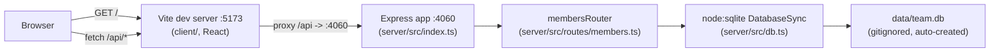

- The client never talks to port 4060 directly — Vite's dev-server proxy
  (`client/vite.config.ts`, `server.proxy['/api']`) rewrites `/api/*` to
  `http://localhost:4060`. There's no CORS config needed on that path, but
  `server/src/index.ts` still calls `app.use(cors())` — relevant if the API
  is ever hit from a different origin than the Vite proxy (e.g. `pnpm start`
  serving only the compiled API with a separately hosted client).
- `getDb()` in `db.ts` is a lazy singleton: the first call opens (and, if
  needed, creates + seeds) the SQLite file; every route handler calls
  `getDb()` per-request but gets the same connection.
- There is no separate migrations system — schema (`CREATE TABLE IF NOT
  EXISTS`) and seed data live inline in `getDb()` and run on first access.
