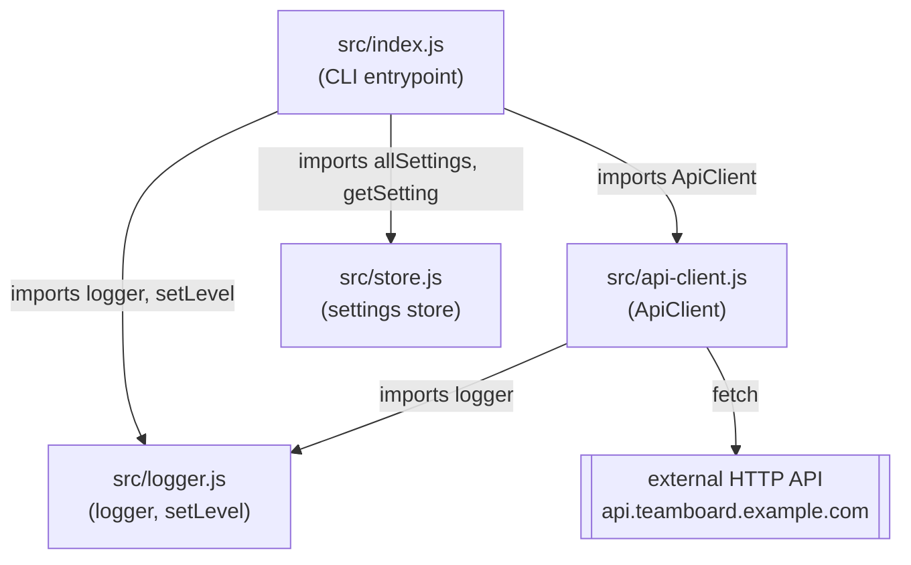

Everything runs in a single Node process — there is no network boundary
between these modules, just plain ESM imports.

Notes on the edges:

- `tasks` command path: `index.js` → `ApiClient.listTasks()` → `ApiClient.request()`
  → `fetch()` against a hardcoded base URL (`src/api-client.js:15`). The retry
  loop in `request()` also calls back into `logger.warn` on each failed
  attempt.
- `status` command path: `index.js` → `store.allSettings()`, no network
  involved.
- `store.js` and `api-client.js` never import each other — the only shared
  dependency between the two "business logic" modules is `logger.js`.
