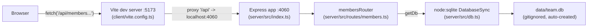

- The client never talks to port 4060 directly in dev — it calls relative paths (`/api/members`, see `client/src/App.tsx:30,36,49,71`), and Vite's dev-only proxy (`client/vite.config.ts:8-10`) forwards `/api/*` to `http://localhost:4060`. In production there is no built-in reverse proxy — `client` is a static Vite build with no equivalent proxy step configured in this repo, so serving the built client behind the API host is left to whoever deploys it.
- `getDb()` (`server/src/db.ts:11`) is a lazy singleton: the first call creates/opens the SQLite file (or `:memory:` if `TEAMBOARD_DB_PATH` is set) and runs `CREATE TABLE IF NOT EXISTS` + seed inserts; every later call reuses the same in-process `DatabaseSync` handle. There is no connection pool — one process, one handle.
