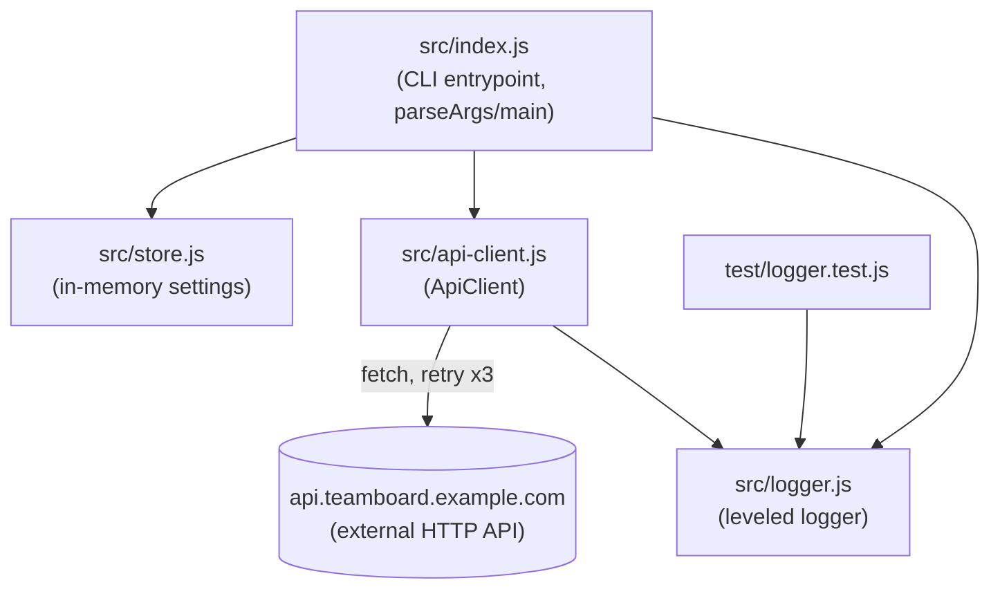

There is no client/server split, no database, and no web framework in this repo — it
is a single Node CLI process plus one outbound HTTP dependency.

- `src/index.js` is the only module with fan-out — it imports and calls into all
  three others (src/index.js:9-11).
- `src/api-client.js` is the only module that talks to the network. `ApiClient.request`
  retries up to 3 times with exponential backoff and a 15s per-attempt timeout
  (src/api-client.js:19-39), logging each retry through `src/logger.js`.
- `src/store.js` is read-only from the CLI's perspective in current code — `getSetting`
  is called (src/index.js:58) but nothing in `src/` currently calls `setSetting`.
- `test/logger.test.js` is the only test file and only exercises `src/logger.js`.
