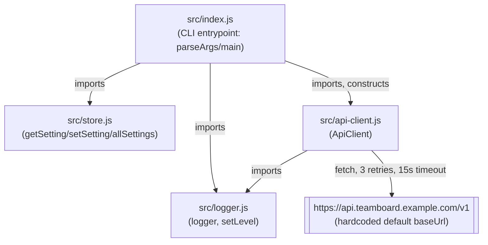

Four modules, no layering beyond "the entrypoint wires the other three together."
`api-client.js` is the only module with an external dependency (the upstream
task API, called via the global `fetch`).

Notes:
- `ApiClient` takes an optional `baseUrl` constructor arg but `index.js` always
  constructs it with no argument (`new ApiClient()`), so in practice the
  hardcoded default in `src/api-client.js:15` is always what's used.
- `store.js` holds settings in a module-level `Map` — state is process-global
  and lost on restart; there is no persistence layer.
- No module reaches into another's internals; all cross-module calls go
  through the named exports shown above.
