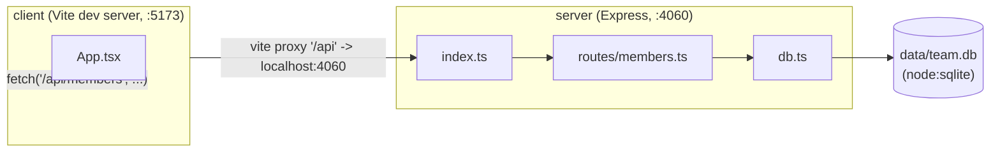

Two independently-run processes, wired together only by the Vite dev proxy (`server: { proxy: { '/api': 'http://localhost:4060' } }` in `client/vite.config.ts`) — there is no shared code, no monorepo workspace boundary, and no build-time coupling between `client/` and `server/`. `pnpm dev` just runs both via `concurrently` (`package.json`).

`db.ts` lazily creates the SQLite file and seeds it on first `getDb()` call — there's no separate migration or seed script.
