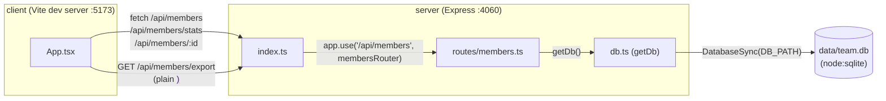

- The Vite config (`client/vite.config.ts`) proxies `/api` to `http://localhost:4060`, so in dev the client never talks to the server directly — always through the proxy. There's no separate API base URL to configure.
- `getDb()` is a lazy singleton (module-level `db` variable) — the file is created and seeded only on first call, not at server startup. Every route handler calls `getDb()` per-request rather than holding a reference.
- CSV export (`/api/members/export`) is a plain link (`<a href>` in `App.tsx`), not a `fetch` call — it triggers a full browser navigation/download, not an XHR.
