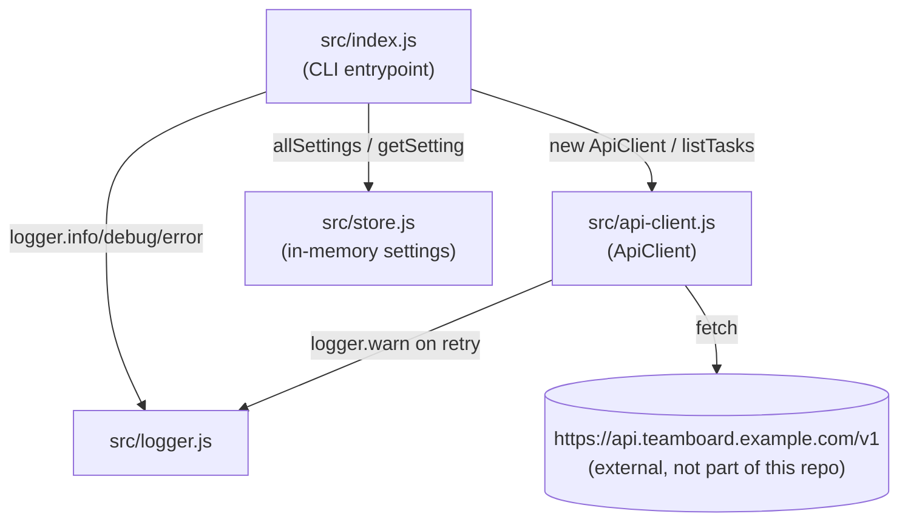

Single-process Node CLI, no build step, no network services of its own. The only outbound
network call is `ApiClient.request` hitting an external (unimplemented/mock) task API.

Notes:
- `ApiClient` depends on `logger` (to log retry warnings) but not on `store` — the CLI is what
  reads `store.getSetting('retention.days')` and passes nothing to the client from it (the
  setting is read but not actually threaded into the request today).
- `store.js` is read/written only from `index.js` in the current code; nothing else imports it.
- There is no persistence layer — `store.js`'s `Map` resets on every process start.
