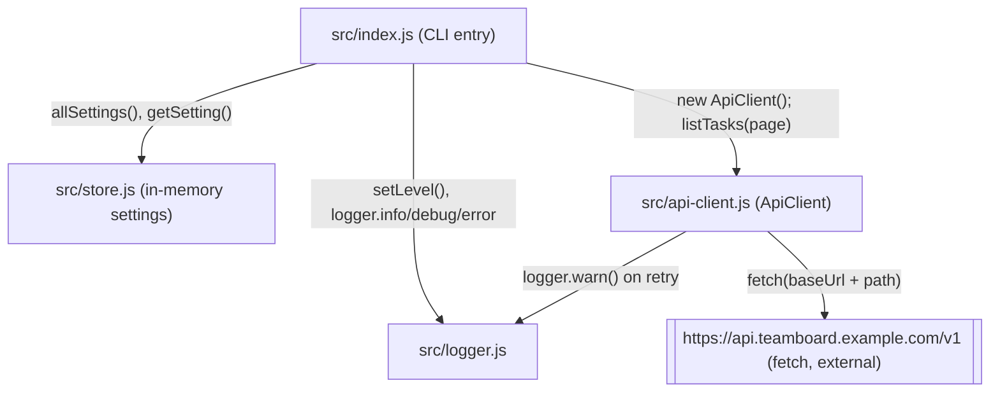

Single-process Node CLI, no network server, no database. `src/index.js` is
the only entrypoint and imports the other three modules directly; none of
the other modules import each other except `api-client.js`, which logs
through `logger.js`.

Notes on edges that aren't obvious from the diagram:

- `ApiClient` is instantiated fresh per `tasks` command invocation in
  `index.js`; it is not a singleton and holds no state beyond `baseUrl` /
  `region`.
- `store.js`'s settings map is module-level (`const settings = new Map()`),
  so it's effectively a process-global singleton shared by whichever code
  imports it — there's exactly one instance for the CLI's lifetime.
- `logger.js` picks stdout vs stderr per call (`warn`/`error` → stderr,
  `debug`/`info` → stdout) based on level, not on any config.
