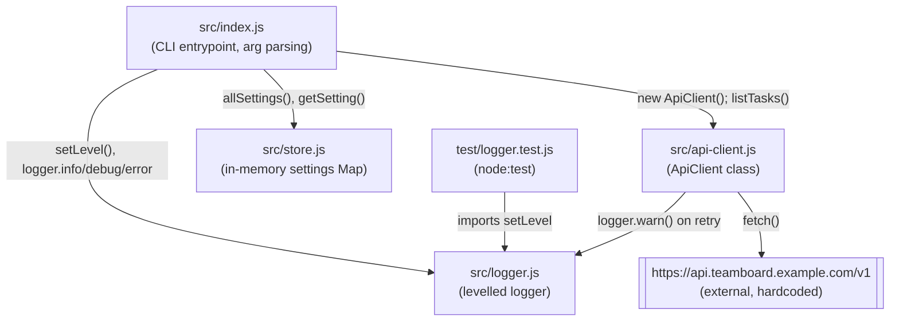

Single-process Node CLI, four modules, no server/client split, no database.

Notes on edges that aren't obvious from file names:

- `src/index.js`'s `tasks` command is the only path that touches `ApiClient`;
  `status` and `help` never make network calls.
- `ApiClient.request()` calls back into `logger.warn` on every retry attempt,
  so `logger.js` has two callers, not one.
- There is no `src/config.ts` and no env-var reads anywhere in `src/` — see
  the divergence note in [[overview]].
