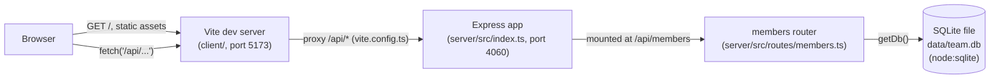

- Client and server are two separate processes (`pnpm dev` runs both via `concurrently`); they only communicate over HTTP through the Vite proxy — there is no direct import between `client/` and `server/`.
- `getDb()` in `server/src/db.ts:11` lazily opens a single module-level `DatabaseSync` handle and seeds it on first call; every request handler in `members.ts` calls `getDb()` again but gets the same cached connection.
- Tests bypass the file DB entirely: `server/src/routes/members.test.ts` sets `TEAMBOARD_DB_PATH=':memory:'` before the first `getDb()` call and boots an ephemeral in-process Express server on a random port — no network dependency on port 4060.
