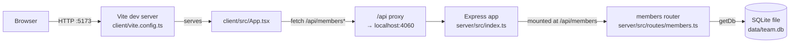

- The client never calls the server directly by port in dev — it fetches relative `/api/...` paths, and Vite's dev-server proxy (`client/vite.config.ts:8-10`) forwards those to `http://localhost:4060`. In production there is no proxy config, so the client would need to be served behind something that does this forwarding (not present in this repo).
- `pnpm dev` runs both processes concurrently (`concurrently` in `package.json`) — server via `node --watch dist/server/index.js`, client via `vite`. The server must be built once (`pnpm build`) before `dev:server` has a `dist/server/index.js` to watch.
- All member routes live in one router file and share the single `getDb()` handle — there is no service layer or ORM between routes and raw SQL.
