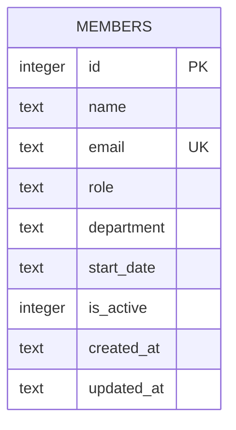

Single table, created via inline `CREATE TABLE IF NOT EXISTS` in `getDb()` (`server/src/db.ts:18-30`) — there is no migrations directory or ORM; schema changes mean editing this DDL string directly. `email` is the only unique constraint; the `POST /` handler in `members.ts:39-42` relies on catching a SQLite `UNIQUE` error message substring to return 409, rather than a pre-check query.

`department` is a free-text column with **no validation or enum constraint** at the DB or API layer — see `../conventions/testing.md` for the CI test that documents this as an open gap (TM-105).

Seed data (8 members, `db.ts:37-44`) is inserted only when the table is empty, on every fresh `data/team.db` or `:memory:` DB.
