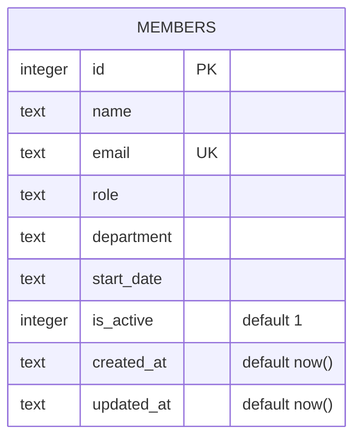

Single-table schema, created on first `getDb()` call if missing
(`server/src/db.ts:18-30`), then seeded with 8 rows if empty. No migrations
directory — schema changes must edit the inline `CREATE TABLE IF NOT EXISTS`
DDL directly, and existing `data/team.db` files won't pick up column changes
automatically (the guard is `IF NOT EXISTS`, not a migration runner).

`is_active` exists in the schema and is read by `GET /api/members` (filters
`WHERE is_active = 1`) and `GET /api/members/stats`, but nothing in
`routes/members.ts` ever sets it to `0` — see [[gotchas]] for why `DELETE`
does not use it.
