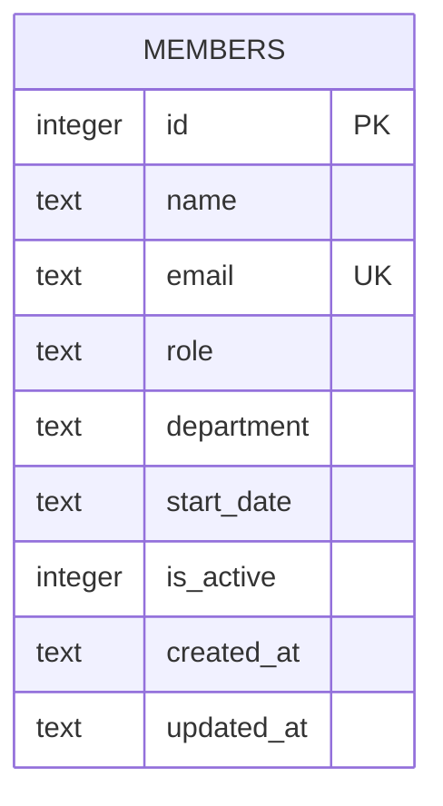

There is a single table, created inline in `getDb()` (`server/src/db.ts:18-30`) — no migration framework, no separate schema files.

- No foreign keys or related tables exist — `department` is a free-text column, not a lookup table (see the TM-105 note in [[gotchas]]).
- `is_active` is a soft-delete flag but `DELETE /api/members/:id` (`server/src/routes/members.ts:106-117`) does a hard `DELETE FROM members`, not a soft-delete via `is_active = 0` — the flag is only ever set at insert time (defaults to `1`) and is never flipped to `0` anywhere in the codebase.
- `email` is the only unique constraint; `name` can collide.
