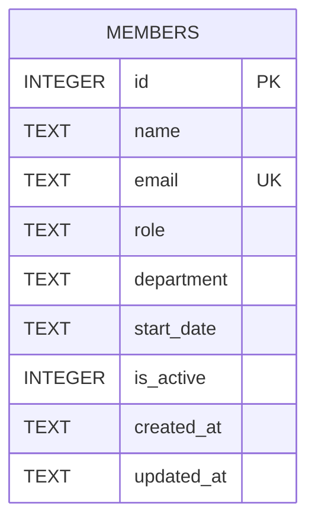

The schema is not a Prisma/migration file — it's a single inline `CREATE TABLE IF NOT EXISTS` in `server/src/db.ts:19-29`, run every time `getDb()` first initializes the connection.

- `email` has a `UNIQUE` constraint; `server/src/routes/members.ts:39-43` catches the resulting SQLite error by matching the string `'UNIQUE'` in `err.message` and turns it into a `409`. There's no separate email-format validation.
- `department` is a free-text column with **no enum/check constraint** — any string is accepted at the DB layer. See [[gotchas]] for why this matters (TM-105).
- `is_active` is an `INTEGER` (0/1) flag, not a real boolean column — `node:sqlite` has no boolean type, so comparisons/filters use `= 1`.
- `start_date` is stored as free-text (`'YYYY-MM-DD'` in seed data), not a SQLite date type.
