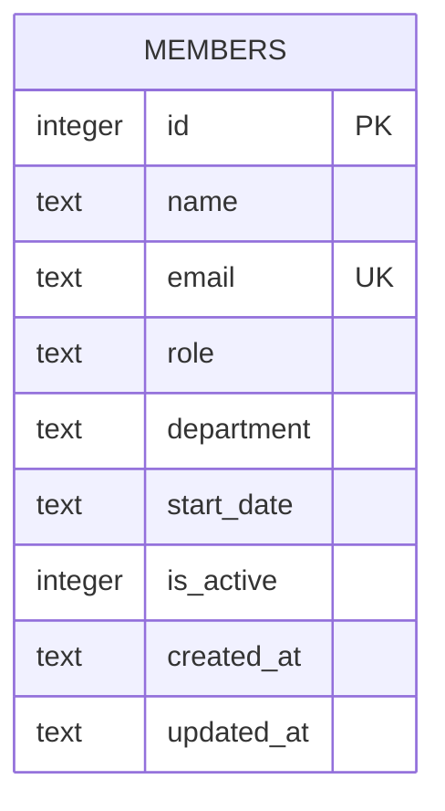

One table, no foreign keys. Schema is created inline in `getDb()` (`server/src/db.ts:18-30`) — there is no migrations directory; changing the schema means editing the `CREATE TABLE IF NOT EXISTS` there directly (and `data/team.db` is gitignored, so existing dev DBs won't pick up new columns automatically — delete the file to re-seed with a new schema).

- `email` has a `UNIQUE` constraint; `POST /api/members` catches the resulting SQLite error by matching the string `'UNIQUE'` in `err.message` to return 409 (`server/src/routes/members.ts:40-43`) rather than checking a typed error code.
- `department` has **no** check constraint or enum — any string is accepted at the DB layer. See [[gotchas]] for why that matters right now.
- `is_active` is an `INTEGER` (SQLite has no boolean type); soft-delete isn't implemented anywhere — `DELETE /api/members/:id` does a real `DELETE FROM members`, it doesn't flip `is_active`.
