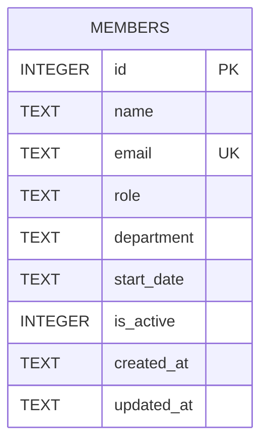

Single-table schema, created inline in `getDb()` (no migration files):

- `email` has a `UNIQUE` constraint; `POST /api/members` catches the resulting
  SQLite error and turns it into a 409 (see `members.ts`).
- `department` is a free-text column with no enum/lookup table or CHECK
  constraint — any string is accepted by the schema itself. See [[gotchas]]
  for the in-flight validation gap at the API layer.
- `is_active` defaults to `1` and is used to filter `GET /api/members`, but
  no route ever sets it to `0` — see [[gotchas]] for why DELETE doesn't use it.
- Seed data (8 members) is inserted only when the table is empty, in
  `server/src/db.ts`.
